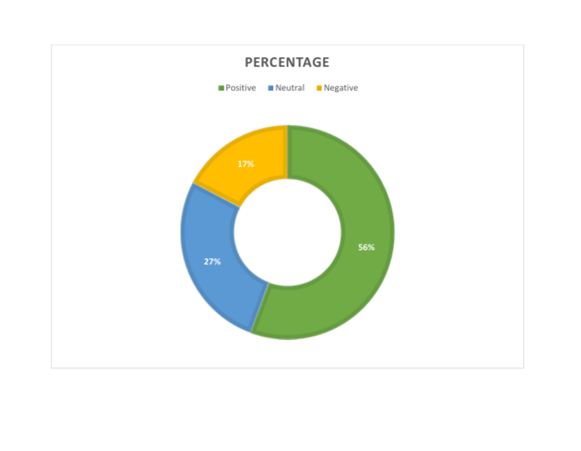

# 🧠 Customer Sentiment Analysis Project

## 👩🏽‍💻 Project Overview

This project analyzes **Amazon product reviews** to determine the
**overall customer sentiment** --- Positive, Neutral, or Negative.\
It uses data from **Kaggle (by saurav9786)** and applies Python tools
for cleaning, analysis, and visualization.

------------------------------------------------------------------------

## 📦 Dataset Information

-   **Source:** [Kaggle -- Amazon Product Reviews (by
    saurav9786)](https://www.kaggle.com/datasets/saurav9786/amazon-product-reviews)\
-   **Total Reviews Analyzed:** 7,824,481\
-   **Main Columns:**
    -   `reviewerID` -- unique ID of the reviewer\
    -   `asin` -- Amazon product ID\
    -   `overall` -- product rating (1--5 stars)\
    -   `unixReviewTime` -- timestamp

------------------------------------------------------------------------

## 🧰 Tools and Libraries Used

-   **Python 3**
-   **pandas** -- for data manipulation\
-   **zipfile** -- to extract zipped datasets\
-   **matplotlib** -- for visualization\
-   **TextBlob** -- for sentiment polarity analysis (future step)

------------------------------------------------------------------------

## 🔍 Process and Steps

### 1. Data Extraction

``` python
import zipfile
with zipfile.ZipFile("Amazon product reviews.zip", "r") as zip_ref:
    zip_ref.extractall("dataset_folder")
```

### 2. Data Loading

``` python
import pandas as pd
df = pd.read_csv("dataset_folder/amazon_product_reviews.csv")
df.head()
```

### 3. Sentiment Classification

Ratings were categorized as:\
- **Positive:** 4--5 stars\
- **Neutral:** 3 stars\
- **Negative:** 1--2 stars

``` python
def classify_sentiment(rating):
    if rating >= 4:
        return 'Positive'
    elif rating == 3:
        return 'Neutral'
    else:
        return 'Negative'

df['Sentiment'] = df['overall'].apply(classify_sentiment)
```

### 4. Result Summary

``` python
df['Sentiment'].value_counts(normalize=True) * 100
```

------------------------------------------------------------------------

## 📊 Visualization: Sentiment Percentage

The chart below shows the distribution of customer sentiments across
Amazon product reviews.



-   **Positive:** 56%\
-   **Neutral:** 27%\
-   **Negative:** 17%

✅ The majority of customers expressed positive experiences, confirming
high satisfaction levels.

------------------------------------------------------------------------

## 💡 Next Steps / Improvements

-   Apply **TextBlob** to analyze **reviewText** and compare text-based
    sentiment vs. star ratings.\
-   Perform **time-based trend analysis** (to see changes in
    satisfaction over months/years).\
-   Visualize most frequent keywords in positive and negative reviews
    using **word clouds**.

------------------------------------------------------------------------

## ✍🏽 Author

**Idaraobong Sammy**\
Internship Project \| Sentiment Analysis \| Data Analytics Enthusiast
